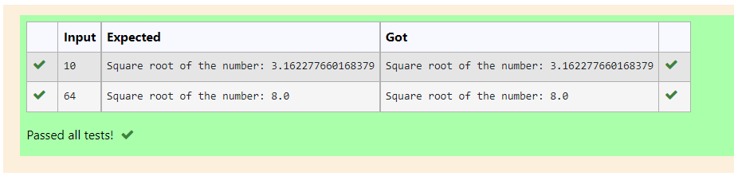

# Find the square root of a number

## AIM:
To write a program to find the square root of a number.

## Equipments Required:
1. Hardware – PCs
2. Anaconda – Python 3.7 Installation / Moodle-Code Runner

## Algorithm:
### Step 1:
1. Define a function.
### Step 2:
2. Assign number_iters = 100 in the function to perform 100 iteratios.
### Step 3:
3. Set i = 0.
### Step 4:
4. Calculate  number = 0.5 * (number + a / number) for 100 iterations.
### Step 5:
5. Return number and end the program

## Program:
```
Program to find the square root for the given number(newton's method) using function.
Developed by: Vaishnavi M
RegisterNumber: 21500310 
def sqrt(x):
    for i in range(10):
        x=0.5*(x+b/x)
    print("Square root of the number:",x)
x=int(input())
b=x
sqrt(x)
```

## Output:



## Result:
Thus the program to find the square root for the given number(newton's method) using function is written and verified using python programming.
